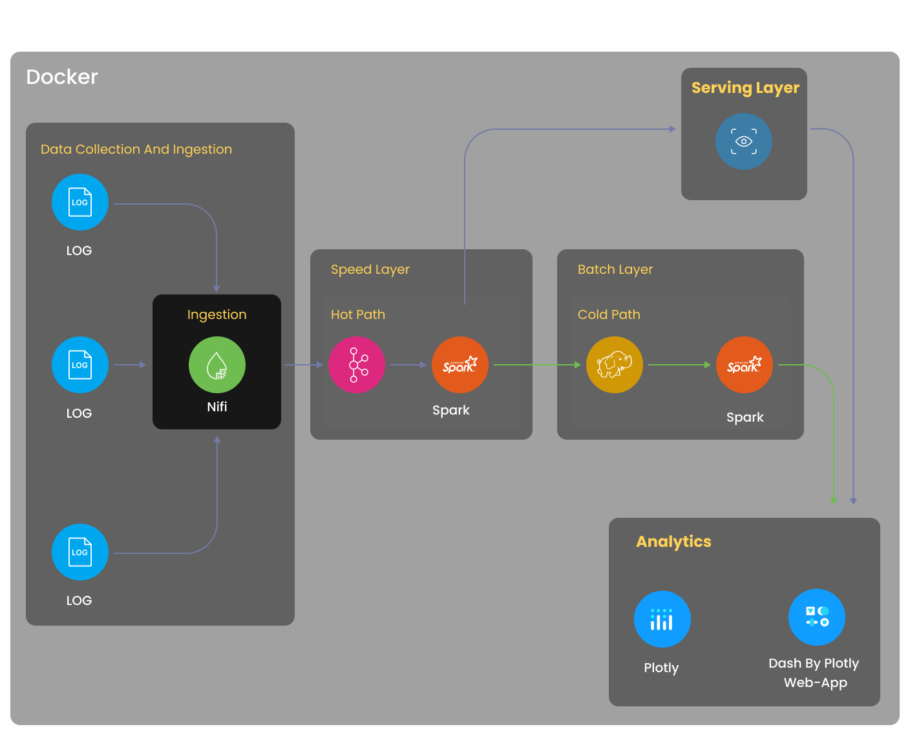

# NASA_Log_Analytics

## Basic architecture

The agenda of the project involves Real-time log analysis with the visualization web
app. We first launch an EC2 instance on AWS and install Docker in it with tools like
Apache Spark, Apache NiFi, Apache Kafka, Jupyter Lab, Plotly and Dash. Then, we
perform preprocessing on sample data, parse it into individual columns, cleaning the
data and formatting timestamp. It is followed by Extraction of NASA access log dataset
using Apache NiFi and Apache Kafka, followed by Transformation and Load using
Cassandra and HDFS and finally Visualizing it using Python Plotly and Dash with the
usage of graph and table app call-back.

## Usage of Dataset:
Here we are going to use NASA access log data in the following ways:
* Extraction: During the extraction process, the downloaded dataset from Kaggle is
ingested using NiFi processors and connections. The data is streamed from the data
file using NiFi followed by the creation of topics and publishing logs using Apache
Kafka.

* Transformation and Load: During the transformation and load process, we read data
from Apache Kafka as streaming Dataframe according to schema creation with
extraction and cleansing of log data and loading to Cassandra for Speed layer and HDFS
for Batch layer. Then data is visualized using Plotly in Dash.